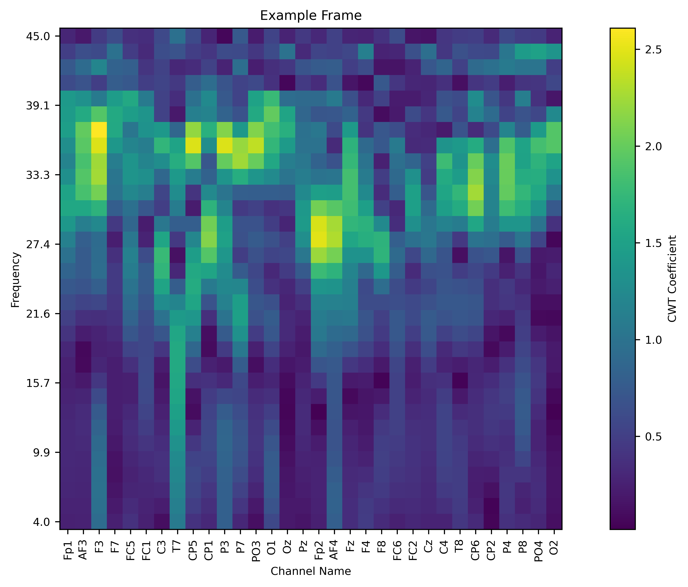

# Emotion Recognition Thesis
A master's thesis on recognizing emotions from EEG data with **vision transformers** and **continuous wavelet transform (CWT)**

###### *Note: this is currently still a work in progress -- code and results are not final*

## Background
Emotion recognition is regarded as an important topic in the field of affective computing. The ability to accurately classify emotions from brain data would have potential for applications in BCIs, human-machine interaction, psychotherapy, and medicine.

As the capability of machine learning models have improved in recent years, the feasibility of developing an effective emotion recognition model has grown alongside it, which has brought more attention to the topic as of late. Previous attempts at emotion recognition utilized both conventional machine learning approaches (KNN, SVMs, RF), and deep learning approaches (RNNs, CNNs, GCNNs). Most recently, *transformers* have shown the most promising improvements over previous methods.

Approaches that utilize transformers vary in terms of model architecture and features extracted from EEG data. For example:

Model | Features | Architecture
--- | --- | ---
SAG-CET | spatiotemporal | TF + GCNN
STS-TF | spatiotemporal | TF
ERTNet | spatiotemporal | TF + CNN
SECT | DE, PSD | TF
MACTN | temporal | TF + CNN

Of these approaches, the **vision transformer** and **CWT** are the least explored architecture and feature extraction method. Interestingly, this combination also shows promise, since CWT provides a visual input that lends itself to a vision transformer.

This thesis demonstrates an approach to emotion recognition using vision transformers trained on CWT features extracted from EEG data.

## Methods
# Data and preprocessing
The dataset used is a preprocessed version of the DEAP dataset. CWT data was obtained using the fCWT library, which was then reoriented to create "frames" that display CWT values for each channel at one point in time.

These frames are then stacked together to create "video" input for a 3D vision transformer model.
