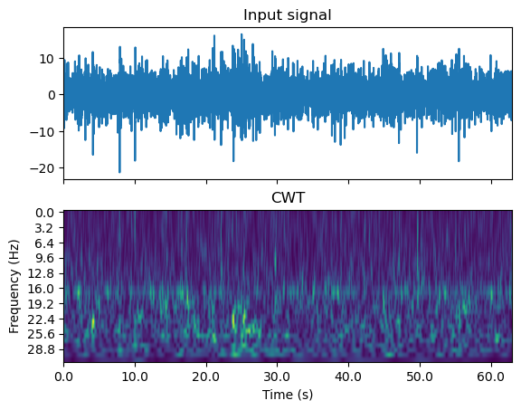
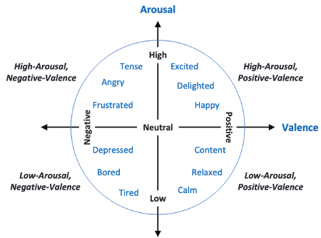
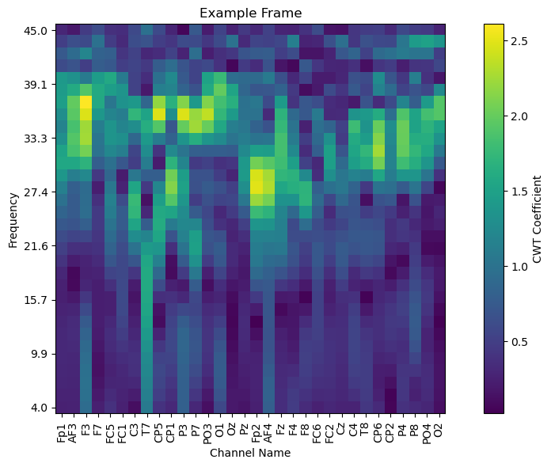

# Emotion Recognition Master's Thesis
Recognizing Emotions from EEG data with **vision transformers** and **continuous wavelet transform (CWT)**


###### *Note: this is currently still a work in progress -- code and results are not final!*

## Background
Emotion recognition is regarded as an important topic in the field of affective computing. The ability to accurately classify emotions from brain data would have potential for applications in BCIs, human-machine interaction, psychotherapy, and medicine.

As the capability of machine learning models have improved in recent years, the feasibility of developing an effective emotion recognition model has grown alongside it, which has brought more attention to the topic as of late. Previous attempts at emotion recognition utilized both conventional machine learning approaches (KNN, SVMs, RF), and deep learning approaches (RNNs, CNNs, GCNNs). Most recently, *transformers* have shown the most promising improvements over previous methods.

Approaches that utilize transformers vary in terms of model architecture and features extracted from EEG data. For example:

Model | Features | Architecture
--- | --- | ---
SAG-CET | spatiotemporal | TF + GCNN
STS-TF | spatiotemporal | TF
ERTNet | spatiotemporal | TF + CNN
SECT | DE, PSD | TF
MACTN | temporal | TF + CNN

Of these approaches, the **vision transformer** and **CWT** are the least explored architecture and feature combination. Interestingly, this combination also shows promise, since CWT provides a visual input that lends itself to a vision transformer.



This thesis demonstrates an approach to emotion recognition using vision transformers trained on CWT features extracted from EEG data.

## Methods
### Data and preprocessing
The dataset used is a preprocessed version of the [DEAP](https://www.eecs.qmul.ac.uk/mmv/datasets/deap/download.html) dataset. This dataset provides EEG recordings of participants' responses to emotional stimuli. These stimuli were also rated on continuous scales of valence and arousal (1 - 9). Using these two values, the data can be split into 4 distinct classes by using a threshold of 4.5:
* **LVLA**: low valence, low arousal
* **LVHA**: low valence, high arousal
* **HVLA**: high valence, low arousal
* **HVHA**: high valence, high arousal


CWT features were extracted using the [fCWT](https://github.com/fastlib/fCWT) library. These features were then reoriented to create "frames" that display CWT values for each channel at one point in time.



These frames are then stacked together to create "video" inputs for a 3D vision transformer model (an example of which can be seen at the top of the page). These videos were also augmented using Gaussian noise to increase the number of samples used to train the model. 

### Model and training
The model is an implementation of a 3D vision transformer obtained from the [vit-pytorch](https://github.com/lucidrains/vit-pytorch#3d-vit) library:
```python
from vit_pytorch.vit_3d import ViT

vit = ViT( # vision transformer parameters follow suggestions from Awan et al. 2024
    image_size=32,
    frames=768,
    image_patch_size=16,
    frame_patch_size=96,
    num_classes=4,
    dim=768,
    depth=16,
    heads=16,
    mlp_dim=1024,
    channels=3,
    dropout=0.5,
    emb_dropout=0.1,
    pool='mean'
)
```
A unique model was created for each of the 32 subjects present in the DEAP dataset. Each model was trained for 50 epochs on an 80% split of the data containing both original and augmented samples. This split was also stratified by class of emotion. Accuracy metrics were recorded for valence and arousal individually, along with overall accuracy. 

## Results (so far) 
Subject-dependent models average accuracy (95% CI):
Valence | Arousal | Overall
--- | --- | ---
(98.57, 99.28) | (98.61, 99.38) | (97.87, 98.93)

## Plans
This is still a work in progress. There are a number of things that I am still currently working on. A (non-comprehensive) to-do list is below:
- [ ] Train a cross-subject model (model trained on data from all participants)
- [ ] Confusion matrix for cross subject model
- [ ] Other classification metrics for all models (precision, recall, f1, etc.)
- [ ] Finetune cross-subject model on private dataset

## Other info
This thesis will be submitted to the graduate faculty of The University of Georgia in partial fulfillment of the requirements for the degree Master of Science in Artificial Intelligence.

### Acknowledgments
I would like to thank UGA's Institute for Artificial Intelligence for the support provided during the writing of this thesis. It wouldn't have been possible without the resources and guidance they've given me.

### Packages and data:
[fCWT](https://github.com/fastlib/fCWT)

[vit-pytorch](https://github.com/lucidrains/vit-pytorch#3d-vit)

[DEAP](https://www.eecs.qmul.ac.uk/mmv/datasets/deap/download.html)


